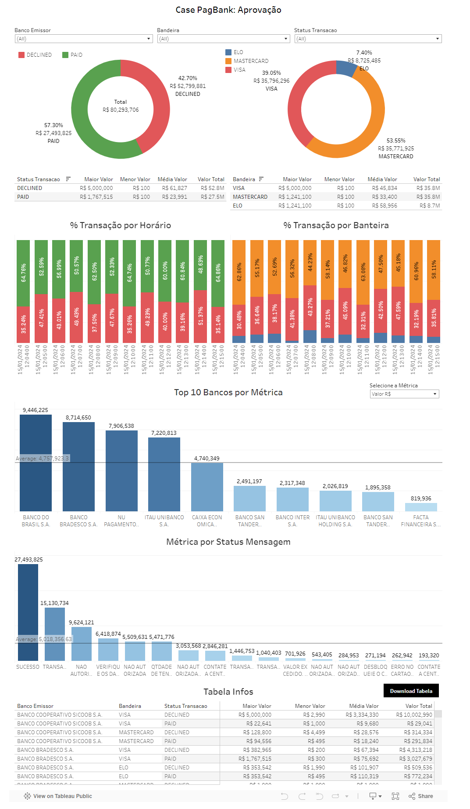

<h1 align="center">Case PagBank - Índice de Aprovação</h1> 

> Análise de dados de case na área de performance do índice de aprovação em adquirência online no PagBank

---
## **Contextualização**

O **índice de aprovação** é uma métrica que mede a proporção de transações online que são aprovadas. Um índice de aprovação alto é importante para as empresas de adquirência online, pois significa que elas estão capturando mais receita. Com isso mente, este case visa analisar os dados do cliente João, pois ele nos contatou dizendo que percebeu uma queda brusca nas vendas, e que também teve um aumento na quantidade de chamados na central de operação do site de clientes reclamando que não estavam conseguindo pagar. Para mais detalhes sobre o case, recomendo observar os slides da apresentação [Case Aprovação: Pagbank](https://docs.google.com/presentation/d/15dJvaY8vaGhhe3b1lkjBEGH2pVvCUniicZCPFSweWIw/edit?usp=sharing) 

---
## **Integrantes**
- [Thiago Silva](https://www.linkedin.com/in/thiagosilvafarias/)

---
## **Base de Dados**
- arquivo base_material_apoio (PagBank)
- arquivo df_pag_bank_preprocessed: arquivo gerado após o pré-processamento, e utilizado como fonte de dados na criação do Dashboard
- [Normativo 21 ABECS](https://api.abecs.org.br/wp-content/uploads/2019/09/Normativo-021.pdf): detalhes de motivos de recusa das bandeiras/bancos emissores.
- [Cartilha Mercado de Meios de Pagamento ABECS](https://api.abecs.org.br/wp-content/uploads/2019/11/Cartilha-da-Abecs-sobre-o-Mercado-de-Meios-de-Pagamento.pdf): informações sobre o funcionamento macro do setor.

---
## **Tableau Public**
* [Case PagBank Aprovação](https://public.tableau.com/app/profile/thiago.silva.farias/viz/PagBank/PagBank?publish=yes): Dashboard Tableau utilizando base de dados de apoio após o pré-processamento.

---
## **Análise dos Dados**

Questões a serem respondidas:
- Como está a aprovação do cliente?
  - Em relação ao número de transações: 854 negadas (42,70%), 1.146 aprov. (57,30%)
  - Em relação ao valor transacionado: R$52.800M negados (65%), R$27.494M aprov. (35%)
- Teve um aumento na quantidade de chamados na central de operações do site de clientes reclamando que não estavam conseguindo pagar;
  - Observando o top 3 de cada bandeira, conclui-se que são problemas que realmente levaria clientes a chamar a central de operações do site de clientes.
  - Status Mensagens: “Não autorizado pelo PagSeguro”, “Não autorizado - Tente novamente usando autenticação”, “Contate a central do seu Cartão”

Recomendações:
**Focar na validação das transações com “erro de processamento” e nas de valores extremos transacionados que podem ser fraudes:** 
- A grande variação nos valores das transações (máximo de R$5.000.000) pode indicar transações atípicas ou potencialmente suspeitas de fraude. Vale a pena investigar transações com valores extremamente altos para garantir a legitimidade.

**Melhorar o processo de comunicação de erros:**
- Trabalhar com a equipe de TI para implementar mensagens de erro mais claras/padronizadas para transações negadas para os clientes, conforme as diretrizes do Normativo-021 da Abecs. Isso pode ajudar a esclarecer o motivo das negativas para os clientes e diminuir o número de chamados.

**Revisar e Reforçar:**
- Verificação de Dados: Revisar o processo de entrada de dados do cartão no site para minimizar erros de digitação.
- Suporte ao Cliente: Reforçar o treinamento do suporte ao cliente para lidar de maneira mais eficiente com questões relacionadas às transações negadas.
- Educação do Consumidor: Informar os consumidores sobre as práticas recomendadas para evitar erros comuns que levam a transações negadas.

---
## **Link slides da apresentação:** 
- [Case Aprovação: Pagbank](https://docs.google.com/presentation/d/15dJvaY8vaGhhe3b1lkjBEGH2pVvCUniicZCPFSweWIw/edit?usp=sharing)

---
## **Dashboard**

    

